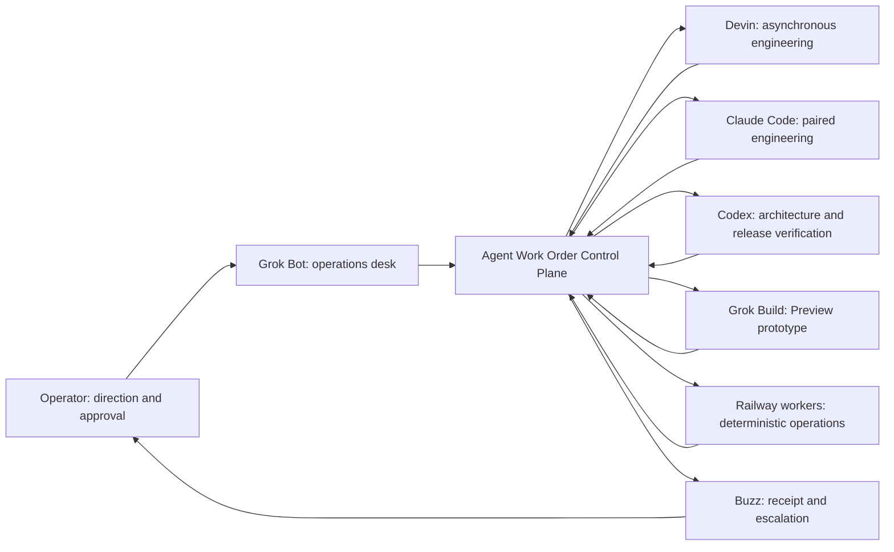
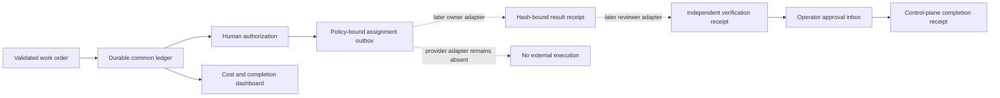

# ADR-018: CoinEasy AI company control plane

**Status:** Accepted; Phase 1B implementation staged locally, not deployed

**Date:** 2026-08-20
**Deciders:** CoinEasy operator

## Context

CoinEasy already has specialized content, QA, review, publication, and coding
agents. Each component works, but they do not share one authoritative company
objective, work-order state, ownership lease, approval receipt, or completion
receipt. Connecting every agent directly to every other agent would add loops
and duplicate actions without fixing that missing source of truth.

The control plane must:

- let the operator set direction and approve exceptions in natural Korean;
- route one bounded task to one owner;
- preserve exact input, version, repository SHA, evidence, budget, and policy;
- separate planner, executor, reviewer, approver, and external-action writer;
- remain useful when any conversational or coding provider is unavailable;
- keep automatic publication and Production changes behind explicit approval;
- report business state without requiring the operator to read raw receipts.

## Decision

Add a thin Agent Work Order Control Plane. Supabase will eventually be its
durable source of truth. Grok Bot is the human-facing operations desk; Buzz is
notification and audit transport; agent adapters execute only authorized work.

In the target architecture, agents will not treat chat messages as state. They
will exchange immutable `agent-work-order@1` records and append-only events
after the durable ledger and adapters exist.

**Target architecture (not the current Phase-zero runtime):**



## Role boundary

| Role | Owns | Cannot own |
| --- | --- | --- |
| Operator | Objectives, priorities, budgets, exceptions | Repetitive polling |
| Grok Bot | Human explanation and bounded proposals | Approval, code, deploy, publish |
| Buzz | Delivery and decision receipts | Planning or retries |
| Devin | One authorized asynchronous coding branch | Merge, Production, self-review |
| Claude Code | One authorized paired coding branch | Same branch as another writer |
| Codex | Architecture, independent review, exact-SHA rollout verification | Self-approval |
| Grok Build | UI prototype and Preview artifact | Production source of truth |
| Railway/Supabase | State, scheduling, caps, leases, outboxes | Creative judgement |

## Phase-zero work-order protocol

The version-one contract is implemented locally in `core/agent_control/`.
It binds:

- objective and causation IDs, idempotency key, client, one owner, and one
  reviewer;
- exact repository/base SHA/branch/allowed paths for engineering work;
- content-hashed evidence, expected local artifacts, acceptance criteria, and
  verification commands;
- a 14-day maximum window;
- one handoff, bounded runtime, zero cost, zero external actions, and automatic
  publication OFF.

This contract is **planning-only**. It validates and renders a proposal but
cannot prove human identity or authorization. It cannot execute a provider,
edit a workspace, push a branch, create a PR, deploy, send a message, or write
to a database. The CLI's `scope_sha256` is a cross-agent consistency digest,
not an approval receipt.

Phase zero accepts only regular, non-symlink local evidence inside an explicit
repository root. HTTPS evidence is rejected until a durable fetch receipt can
prove the observed bytes.

Other adapters can inspect the exact JSON Schema without network access:

```text
python -m scripts.run_agent_work_order --print-schema
```

The scope digest uses the documented scalar-only canonical subset emitted by
`canonical_scope()`: recursively sorted object keys, UTF-8 JSON without extra
whitespace, UTC timestamps normalized to whole-second `Z`, ordered arrays, and
no floating-point values. Golden hash tests must accompany any TypeScript or
provider adapter before it can create a durable record.

The future durable state machine is deliberately narrow:

```text
proposed -> authorized -> claimed -> in_progress -> awaiting_review
         -> verified -> approved -> completed

authorized/claimed/in_progress/awaiting_review/verified/approved
         -> blocked

authorized -> cancelled
```

It is not implemented by the phase-zero local CLI. When the Supabase ledger is
added, only the owner will claim and produce a hash-bound result, only the
reviewer will submit a verification receipt, and only the human operator will
approve. The control plane—not a reviewer—will close work after all receipts
match. Terminal work will not restart; a revision will create a new work order.

## Phase 1A local control-room projection

Before adding the durable ledger, Phase 1A connects the existing roles through
one **local dry-run projection**. Given one to 32 locally verified
`agent-work-order@1` proposals and an explicit observation time, it produces:

- one proposed owner packet for Devin, Claude Code, Codex, or Grok Build;
- one independent read-only reviewer packet;
- the five-section Korean Grok operator dashboard;
- one Buzz receipt preview whose delivery status is always `not_sent`.

The projection blocks expired and not-yet-active proposals, duplicate
idempotency keys, case-insensitive repository/branch collisions, and
case-insensitive overlapping paths. It keeps the Phase-zero work-order schema
and scope digest unchanged.

Phase 1A lives only in `core/agent_control/` and the stdout-only
`scripts/run_agent_control_room.py` CLI. It has no runtime import, scheduler,
network adapter, environment setting, database write, provider call, Buzz
delivery, or publication path. It does not observe or claim the current state
of Production. The existing independent Grok QA MCP remains unchanged.

```text
PYTHONPATH=. python -m scripts.run_agent_control_room \
  --input examples/agent-work-order-devin-preview.json \
  --input examples/agent-work-order-claude-preview.json \
  --input examples/agent-work-order-grok-build-preview.json \
  --repo-root . \
  --observed-at 2026-08-21T12:00:00Z \
  --dashboard
```

This proves that the participants can read one contract and that the operator
can understand the combined state. It is not the durable Phase 1 ledger and
does not satisfy the gate for unattended execution.

## Phase 1B durable P0 boundary

Phase 1B implements the common ledger and operator projection, but it still does
not turn on an agent provider. Its bounded flow is:



The migration is intentionally deploy-inert until separately applied. Even
after schema deployment, assignment means only a durable `pending` outbox row;
there is no claim, provider-attempt, messaging, deployment, or publication RPC
in this P0 surface. Result and verification receipt types are reserved and
validated, but their writer adapters are also absent. A later provider adapter
requires its own approval and commit-once attempt fence.

P0 keeps every accepted work order at `max_cost_microusd = 0`,
`max_external_actions = 0`, and `automatic_publication = false`. Human operator
writes are bound to the authenticated workspace owner/admin identity instead of
an actor string supplied by the caller. Read models recompute the Python work
order, authorization payload, dispatch packet, and branch digests before showing
an assignment, verification gate, or completion count. A terminal stop requires
a matching human decision receipt. Unknown cost is shown as unobserved, never as
zero; in this zero-cost P0 an observed positive amount is rejected.

The local implementation is split across the two forward-only migrations
`20260825130000_agent_work_order_ledger.sql` and
`20260825131000_agent_work_order_roles.sql`, plus the strict no-I/O projection
in `core/agent_control/durable.py`. None of them has been applied to Production
by this change.

## Durable model

The P0 implementation uses separate FORCE-RLS tables rather than overloading
Content Studio jobs:

- `agent_runtime.agent_work_orders`
- `agent_runtime.agent_work_order_events`
- `agent_runtime.agent_runs`
- `agent_runtime.agent_dispatch_outbox`
- `agent_runtime.agent_action_receipts`
- `agent_runtime.agent_incidents`

Security-definer RPCs own the exposed P0 transitions. Authorization inserts the
approval event and dispatch outbox row in one transaction. Provider-attempt
fences, lease expiry, and `delivery_unknown` semantics will later reuse the
proven Buzz and Grok QA patterns. The ledger enforces a partial unique index on
active branch scope keys and idempotency keys.

Durable records reserve separate `agent-work-result@1`,
`agent-verification-receipt@1`, `operator-decision@1`, and
`agent-completion-receipt@1` digests. No forward transition will be possible
after the work or authorization expiry.

## Interface strategy

- Keep independent Grok QA's existing three-tool MCP unchanged.
- Add a separate `CoinEasy-Ops` MCP only after the ledger exists:
  `list_operator_inbox`, `get_work_order`, `propose_work_order`, and
  `record_operator_decision`.
- Integrate Devin through its task/session API adapter after manual packets.
- Claude Code, Codex, and Grok Build may use MCP or ACP transports, but the
  control plane remains authoritative.
- Use Buzz for human-visible replies and receipts, never as the only database.
- One scheduler owns each recurring workflow.

## Risk tiers

| Tier | Examples | Default |
| --- | --- | --- |
| R0 | Read and analyze | Automatic |
| R1 | Internal draft or Preview artifact | Automatic within policy |
| R2 | GitHub issue, Draft PR, Preview deployment | Human-authorized pilot |
| R3 | Merge, Production, DB write, customer message, publication | Exact explicit approval |
| R4 | Funds, wallet, key revocation, legal commitment | Manual double confirmation |

## Reliability rules

- One owner, branch, and idempotency key per work order. Phase zero checks the
  fields locally; the future ledger enforces cross-order uniqueness and lease.
- No agent-to-agent free-form loops; every handoff references the work order.
- Maximum child depth 3, handoffs 5, and pre-action retries 3.
- No retry after an external action becomes unknown.
- Child work consumes the parent's time and cost budget.
- A planner cannot approve its own proposal; an executor cannot verify itself.
- Credential scope, budgets, and approval policy are not self-modifiable.
- Error-rate, duplicate, or permission drift closes the action gate.

## Consequences

- The operator can use Grok as one understandable company console.
- Specialized agents remain replaceable because they share a versioned task
  contract rather than private chat history.
- The first stage produces less visible automation because external actions are
  intentionally zero while contracts and ownership are proven.
- A durable ledger and provider adapters are still required before unattended
  24-hour execution.

## Rollout

1. Land the planning-only work-order model, renderer, validation CLI, and tests.
2. Render three proposed packets through the local Phase 1A control room and
   review ambiguity, path collision, secret leakage, and test feasibility. Do
   not execute them.
3. Add the durable ledger, authorization/result/verification/completion
   receipts, events, leases, and read-only operations dashboard.
4. Add the separate Ops MCP and Grok operator inbox.
5. Run three authorized local patch tasks with zero out-of-scope files and 100%
   receipt completeness.
6. Add one provider adapter at a time, starting with bounded Devin Draft PRs.
7. Connect Buzz receipts and incident escalation.
8. Run one OriginTrail content slice and one engineering slice in shadow mode.
9. Consider bounded Production automation only after clean-run gates.
