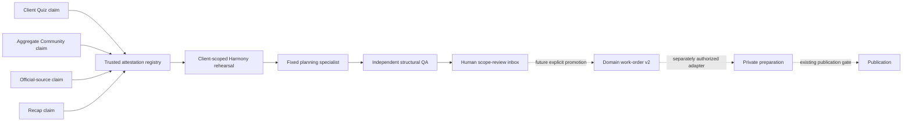

# ADR-019: Federated client-bot Harmony collaboration fabric

**Status:** Accepted for disposable Preview P0. The original six-migration
slice was verified on a deleted child branch; the additive fixed-specialist
seventh migration is locally verified only and is not applied to Production or
a remote Preview branch.
**Date:** 2026-08-25
**Deciders:** CoinEasy representative, content, community, and engineering leads

## Context

CoinEasy currently has four authoritative Content Engine tenants: `yellow`,
`origintrail`, `squid`, and `babylon`. The repository also contains contracts
for official-source ingestion, Korean content preparation, aggregate EasyFarm
community signals, privacy-thresholded quiz learning, independent QA, exact
publication receipts, and monthly KPI reporting.

Those systems are not one autonomous company yet:

- client configurations and official-source ledgers live in Content Engine;
- client quiz execution lives outside this repository and is represented here
  only by the aggregate EasyFarm signal contract;
- Content Ops, Grok QA, Buzz, Devin, Claude Code, Codex, and Grok Build have
  different credentials and authority boundaries;
- community observations cannot become factual content evidence;
- recap metrics may be unobserved and must not silently become zero;
- the durable `agent-work-order@1` contract is intentionally restricted to
  local, zero-cost, zero-external-action engineering work.

Putting every bot in an unrestricted chat room would create cross-client data
leakage, prompt-injection, duplicate fan-out, and publication risks. Expanding
the existing engineering work order to pretend that content and community work
are engineering would invalidate its tested safety assumptions.

## Decision

Add a separate, federated Harmony planning layer in front of the durable work
order ledger. Client bots do not freely chat. They contribute typed,
client-scoped signals to a deterministic collaboration round with exactly six
roles:

The default local CLI has an empty trust registry. It can validate and display
claims, but it cannot create a human handoff. A handoff exists only when a
separately injected runtime verifier has bound all four signals to JWT or
immutable database-receipt attestations. The approved P0 verification used one
disposable Supabase child branch and one Netlify Deploy Preview; it made no
Production, provider, messaging, approval-decision, or publication call.

## Confirmed client and connector state

| Client | Official-source config | Content capability | Quiz in this repository | Harmony live adapter |
|---|---|---|---|---|
| Yellow | Configured | Daily News, Article, Tutorial | Aggregate contract only | No |
| OriginTrail | Configured | Daily News, Article | Aggregate contract only | No |
| Squid | Configured | Daily News, Article, Tutorial | Aggregate contract only | Read-only Deploy Preview, default OFF |
| Babylon | Configured | Daily News, Article | Aggregate contract only | No |

Logical participant IDs such as `yellow_quiz_bot` identify a client-scoped
contract lane. They are not evidence that a particular external service,
credential, or bot username has been inventoried or connected.

## Canonical P0 contracts

### `agent-harmony-signal@1`

Every input binds:

- `workspace_id`, one of the four explicit `client_id` values;
- `producer_principal_id`, release SHA, config SHA, upstream receipt SHA;
- source event, observation and expiry timestamps;
- evidence and canonical payload SHA-256;
- sorted taxonomy codes rather than raw chat, questions, answers, or prompts;
- `advisory_only=true`, cost and external-action caps of zero, and automatic
  publication false.

These fields are claims, not authentication. Input JSON cannot carry its own
attestation or trust registry. `HarmonySignalAttestation` is injected through a
separate runtime-only registry and exact-binds workspace, client, lane,
principal, release/config, source event, upstream/evidence receipt, and payload
hash. The CLI intentionally exposes no registry-file option. `test_fixture`
attestations can exercise structure but can never create a human handoff;
only current `jwt` or `database_receipt` attestations qualify.
Topic codes come from the versioned closed P0 taxonomy in code. Unknown labels,
including user-, wallet-, system-, or instruction-shaped values, fail closed
instead of appearing in a cross-client pattern or dashboard.

The P0 attestation schema is Preview-only and fixes issuer, audience, and a
lane-specific submit capability. A serialized snapshot or handoff has
`portable_trust=false`, is render-only and non-dispatchable, and requires a
trusted registry to re-verify the attestation before any future promotion.
Canonical hashes detect accidental drift; they are not signatures and do not
authenticate a file that has crossed a process boundary.

Signal kinds and factual authority are fixed:

| Kind | Data class | Can support content facts? |
|---|---|---|
| `official_source` | Public official record | Yes |
| `quiz_learning` | Anonymous aggregate, at least 20 attempts/5 participants | No |
| `community_demand` | Anonymous aggregate, one explicit room mapping | No |
| `recap_metric` | Aggregate observed/unobserved metric | No |

The signal idempotency key is derived from workspace, client, producer,
signal kind, source event, and schema. An identical replay is removed. The same
key or signal ID with a different payload hash fails closed.

### `agent-harmony-round@1`

Each round is bound to exactly one client and exactly six deterministic
rehearsal turns:

1. client Quiz contract proposes a learning priority;
2. Community Ops supports or challenges it;
3. Content Engine binds verified official evidence;
4. Recap supplies observed or explicitly unobserved performance context;
5. the fixed Grok planning specialist synthesizes or challenges;
6. the fixed Codex QA specialist previews independent verification.

These turns are not evidence that the named bots actually conversed or that a
separate reviewer receipt exists. No turn accepts instructions from a signal.
Only the attested official-source turn has content factual authority. Missing,
unattested, stale, future, or non-overlapping evidence produces a waiting or
alignment state, never partial execution.
An explicitly unobserved Recap metric may preserve the Recap lane but cannot
vote for topic consensus. Turn speakers, lanes, and signal partitions are
validated against the fixed six-role sequence.

Harmony does not auto-assign a task to whichever model appears suitable. Each
client slice has a versioned specialist roster. Planning, private-content
preparation, independent QA, the representative inbox, and Recap each bind to
one distinct role and principal before a round can start. A role change creates
a new reviewed roster version; it is not a runtime model decision.

### `agent-harmony-handoff@1`

A handoff is produced only when all four lanes have current runtime-verified
attestations and an official topic is independently supported by at least two
of Quiz, Community Ops, and observed Recap. It carries:

- one client and a private control-room channel scope;
- source and contextual signal IDs plus the complete input-set hash;
- the typed payload/attestation manifest and its attestation-set hash;
- the bounded content type supported by that client;
- requested private preparation, recap, and independent-QA capabilities;
- a human scope-review gate;
- Preview-only, render-only, non-dispatchable, and re-verification-required
  trust flags;
- execution, provider, publication, cost, and external-action authority all
  fixed to zero or false.

It is not compatible with `agent-work-order@1` and therefore cannot be silently
dispatched by the existing worker.

### Cross-client learning

A topic appearing in aggregate signals for at least two clients may create a
`planning_practice_only` shared pattern. The pattern explicitly prohibits:

- reuse of factual copy;
- reuse of client artwork or brand assets;
- audience-size ranking between clients;
- automatic child work or publication.

The representative may use it to ask a strategic question. Any adopted work is
split back into separately scoped client plans.

## Options considered

### Option A: One free-chat room for all bots

| Dimension | Assessment |
|---|---|
| Speed | High initially |
| Tenant isolation | Unsafe |
| Auditability | Low |
| Duplicate control | Weak |

Rejected because chat text is neither a durable state transition nor verified
factual evidence, and bot-to-bot replies can loop indefinitely.

### Option B: One central super-agent with every credential

| Dimension | Assessment |
|---|---|
| Coordination | Simple |
| Blast radius | Critical |
| Independent QA | Weak |
| Least privilege | Fails |

Rejected because one compromise could expose every client and publication
surface, and the planner could approve its own work.

### Option C: Federated typed Harmony rounds (chosen)

| Dimension | Assessment |
|---|---|
| Coordination | Structured |
| Tenant isolation | Strong once client-scoped adapters exist |
| Auditability | Hash-bound |
| Rollout cost | Incremental |

This preserves each product as its own source of truth while unifying direction,
responsibility, review, receipts, and the representative dashboard.

## Security consequences

- Existing workspace-only scoped JWTs must never be distributed to client bots.
- A future adapter token must bind workspace, client, capability, environment,
  producer principal, and release/config identity.
- Client bots must not learn whether another client's signals exist.
- Raw questions, answers, choices, messages, user/chat/session/quest/wallet IDs,
  or hashed user identifiers are forbidden.
- Missing telemetry remains unobserved rather than zero.
- Future content facts still require exact official-source receipts.
- QA or representative approval does not replace exact-version publication
  approval and a separate publisher credential.

## P0 implementation and disposable Preview receipt

- `core/agent_control/harmony.py` implements canonical signals, participants,
  typed attestations, an empty-by-default trust registry, six-turn rehearsal
  rounds, handoffs, shared patterns, hashes, and the deterministic projection.
- `scripts/run_agent_harmony.py` reads only a bounded, non-symlink local JSON
  snapshot and renders JSON or the Korean Harmony dashboard.
- Current profiles are loaded from the four existing client configs.
- The CLI always uses the empty registry, so even a complete caller-authored
  four-lane JSON cannot enter the representative approval inbox.
- The original six disposable-Preview migrations add the client-scoped signal and
  database-generated connector-attestation ledgers, the Squid-only typed
  stage chain, FORCE RLS, seven least-privilege roles, and a read-only
  dashboard projection. They are empty by default and require an exact,
  expiring Preview branch fence before any RPC can accept a claim.
- A seventh additive Preview-only migration adds a five-entry Squid specialist
  roster. Each stage is prebound to one distinct principal, release, config,
  branch ref, and maximum two-hour expiry. Stable retries may renew receipt
  UUIDs and JWT metadata but must converge on the same immutable operation key.
  No runtime AI assignment path exists.
- The Squid slice derives private Korean headline/summary only from an existing
  current `needs_review` Daily News version whose natural
  `official_x_review_draft_completed` outbox and canonical `@SquidRouter`
  `x_post_text` source still match. It does not generate a new Batch, call an
  AI provider, send a message, record an approval, or create a publication.
- The independent-QA stage uses a distinct scoped principal and an exact typed
  evidence object bound to the prior private-content output SHA. The operator
  inbox is materialized exactly once by stage 4 and remains `pending`; stage 5
  Recap validates that same inbox and adds no second inbox. Neither stage has a
  decision or publication mutation.
- `GET /api/harmony/dashboard` is Deploy-Preview-only, default OFF, Studio
  session protected, service-role-fallback-free, and requires a short-lived
  Squid dashboard JWT plus a publishable project key. Its UI keeps approval
  and publication controls disabled. Dashboard v2 exposes each stage's fixed
  specialist code, principal, release/config, binding SHA, and stable operation
  key so the representative does not have to trust an actor label alone.
- A clean disposable local PostgreSQL 16 run applied all seven migrations and
  raced 64 independent scoped-role connections against the same quiz signal,
  plan, and each of four downstream stages. Every operation produced one new
  receipt and 63 stable reuses. The complete Squid rehearsal ended with 4
  signals, 4 connector receipts, 1 round, 1 plan, 5 fixed-principal stage
  receipts, 5 distinct operation keys, and 1 pending inbox. Wrong-principal
  preemption wrote zero rows; stage 4 added the inbox and Recap added none.
  Approval, publication, Buzz, provider, and cost baselines were unchanged.
- The earlier approved disposable Supabase child `ynelpztctwonnadrlpfq`
  applied only the original six migrations and both transactional security suites. Real scoped
  HS256-JWT/PostgREST traffic produced 64 calls as one new receipt and 63 exact
  reuses with one identity; the negative matrix rejected wrong scope, role,
  ref, time window, service role, and payload tampering without extra rows.
  The Squid slice ended at 4 signals, 4 connector receipts, 1 round, 1 plan,
  5 stage receipts, and 1 pending operator inbox with recap cost 0. This prior
  remote receipt is not evidence for the fixed-specialist migration, dashboard
  v2, or stage-4 inbox timing.
- The child branch and Preview secrets were deleted after verification. No
  external Quiz connector, scheduler, provider, private message, Production
  adapter, approval decision, or publication path has been activated.

## Known P0 limitations

- The `independent_qa` participant is presently an independently scoped,
  deterministic structural verifier. `codex` is an actor label in its receipt;
  no Codex, Grok, or other model was called and no semantic/factual judgment is
  implied by `verdict=passed`.
- P0 persists only the successful five-stage rehearsal. A malformed or failed
  QA request aborts with zero new rows. Before any Production workflow, a
  separate append-only negative-verdict ledger must preserve denial reasons
  without opening the operator inbox.
- Connector receipts expire with their short-lived Preview JWT. Expired inputs
  disappear from the current dashboard by design, and the same immutable
  signal cannot presently be renewed with a new attestation. A 24-hour runtime
  therefore requires a separately reviewed attestation-renewal model.
- External Quiz services remain `contract_only`. Their real service identity,
  aggregate event receipt, owner, and capability must be inventoried and
  verified one customer at a time.
- Direct PostgreSQL 64-connection verification against the child branch was
  unavailable because the branch database endpoint was IPv6-only from this
  runner. PostgreSQL concurrency remains covered by the disposable local run;
  branch identity, scoped auth, and exactly-once delivery were separately
  proven by the 64-way signed PostgREST run.

## Next rollout gates

1. Stage, commit, and push the fixed-specialist corrections only after a
   separate gate. Regenerate an exact-SHA Deploy Preview and verify that the
   dashboard remains default OFF before any scoped read test; Draft removal
   and merge are separate approvals.
2. If a second live dashboard read is desired, obtain a fresh explicit
   cost/organization/TTL approval for exactly one disposable child branch;
   bind only the exact new Preview SHA and delete its secrets and branch in the
   same work window.
3. Inventory each external Quiz bot's service, owner, event schema,
   destination, and capability. Replace only the synthetic connector lane with
   one actual aggregate-only connector at a time; raw user/chat data remains
   forbidden.
4. Add a revocable attestation registry, signed request digest/nonce, and an
   append-only negative-QA ledger before any long-running or Production use.
5. After 20 clean Squid Preview or staging rounds, add clients one at a time and prove
   isolated typed rounds. Keep every provider, messaging, approval-decision,
   and publication adapter separately gated and default OFF.

Production rollout, live bot messages, provider calls, and publication require
separate approvals after these gates pass.
