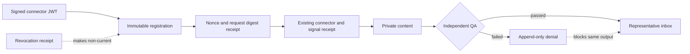

# ADR-020: Harmony revocable trust and durable QA denials

**Status:** Proposed for local CI and exact-SHA Deploy Preview only
**Date:** 2026-08-26
**Deciders:** CoinEasy representative, content, community, security, and
engineering leads

## Context

The disposable Squid Harmony proof established client-scoped RLS, fixed
specialists, signed JWT/PostgREST connector calls, and 64-way exactly-once
convergence. It deliberately did not establish the trust lifecycle required by
a long-running service:

- a connector JWT was checked against claims, but there was no independently
  registered and immediately revocable connector identity;
- the verification reference did not bind the RPC and canonical request
  payload to a dedicated nonce;
- failed QA raised an exception, so the transaction rolled back and left no
  durable, reviewable denial;
- a previously accepted round did not become non-current when its connector
  registration was revoked.

Production, provider, Buzz, approval-decision, publication, and automatic
publication remain outside this decision.

## Decision

Add a Preview-only trust layer with four narrowly scoped ledgers:

1. An immutable connector registration binds one workspace, client, lane,
   capability, connector, producer principal, release, configuration, branch,
   non-secret signing-key identifier, and expiry.
2. Revocation is an append-only receipt. Both request admission and revocation
   lock the registration row, providing a single ordering point without an
   un-revoke path.
3. Every connector request carries a JWT-signed, database-recomputed request
   digest and a dedicated nonce equal to its JWT `jti`. The committed request
   receipt binds the exact token-claim digest, registration, signal, and
   connector receipt. The same signed request may return the existing durable
   result; nonce, digest, or claim drift fails closed.
4. A valid independent-QA `failed` verdict is recorded by a separate RPC as an
   append-only denial receipt and returns a structured denial. It never creates
   a passed QA stage, representative inbox item, Recap, approval decision, or
   publication. Malformed or unauthenticated traffic creates no denial row.

The existing successful connector receipt schema remains unchanged. The new
request receipt composes with it rather than rewriting historical receipt
shape. Current-round evaluation additionally requires the registration and
request receipt to remain current and unrevoked. Revocation therefore blocks
later stages and removes the round from the read-only current projection while
preserving its immutable history.

## Security invariants

- No JWT secret, private key, raw chat, user identifier, or private content is
  stored in the trust tables.
- The request digest includes a domain separator, RPC name, workspace, client,
  registration, logical signal IDs, lane, and canonical signal payload hash.
- `(registration, nonce)` is the linearization key. A 64-way identical request
  yields one new domain result and 63 exact reuses.
- Within the one-shot Preview branch, lane, connector ID, producer principal,
  and attestation key ID are each all-time unique. A new registration UUID
  cannot create a sibling identity that survives revocation; renewal and key
  rotation require a future explicit protocol.
- A connector JWT's integer-second `iat` cannot predate the registration's
  creation second. The same-second comparison is the narrow precision limit of
  the JWT claim and prevents an older credential from becoming valid later.
- The same nonce with a different request or token-claim digest is a typed
  conflict with zero domain-row delta. A new nonce cannot silently renew the
  same logical request.
- Registration expiry, branch-fence expiry, or revocation blocks both new work
  and current-round projection.
- The QA principal cannot equal any signal producer or any planning/content/
  operator/Recap specialist for the round.
- A denial is bound to the database-derived private-content receipt and output
  SHA. A denied output cannot later receive a passed QA receipt.
- Every new table is empty by default, FORCE RLS, directly ungranted, and
  immutable after insert.

## Options considered

### Option A: Keep short-lived JWT expiry as the only revocation mechanism

| Dimension | Assessment |
|---|---|
| Complexity | Low |
| Immediate containment | Weak |
| Auditability | Incomplete |

Rejected because even a two-hour credential needs an explicit kill switch and
a durable identity binding before 24-hour operations.

### Option B: Mutate connector and QA rows in place

| Dimension | Assessment |
|---|---|
| Query simplicity | Medium |
| Historical integrity | Weak |
| Race behavior | Ambiguous |

Rejected because reversible status mutation would weaken the existing
append-only receipt model and complicate request-versus-revocation ordering.

### Option C: Immutable registrations plus append-only trust receipts (chosen)

| Dimension | Assessment |
|---|---|
| Tenant isolation | Strong |
| Replay resistance | Strong |
| Auditability | Strong |
| Implementation cost | Medium |

This preserves the proven connector receipt and stage chain while adding the
minimum durable trust lifecycle needed for the next Squid-only gate.

## Consequences

- Preview runners must seed exact connector registrations before minting JWTs
  and must sign the database-equivalent request digest.
- Connector renewal and signing-key rotation remain explicit future protocols;
  a caller cannot obtain them by changing JWT timestamps or nonces.
- A failed QA output requires a new private-content output or new plan before it
  can be reconsidered.
- Dashboard payload shape can remain unchanged for this gate; revoked or denied
  work is excluded from the current representative inbox. A future audit view
  may expose redacted denial counts under a separate review.
- The migration is Preview-only and fails if any Harmony ledger row already
  exists, avoiding an unaudited backfill.

## Verification gates

1. Apply all migrations to disposable local PostgreSQL and run every
   transactional security suite.
2. Prove identical signed request `new=1/reused=63`, nonce/request/token drift
   with zero row delta, and revocation currentness.
3. Prove valid failed QA `new=1/reused=63`, passed-QA/stage/inbox/Recap delta 0,
   and immutable denial rows.
4. Push only after Python, JavaScript, PostgreSQL, and `git diff --check` pass.
5. Verify the Draft PR's exact head, CI, Netlify Deploy Preview, and dashboard
   API HTTP 503 while the feature flag remains OFF.

Production migration, feature-flag activation, external connectors, provider
calls, messages, approval decisions, and publication remain separate approval
gates.
