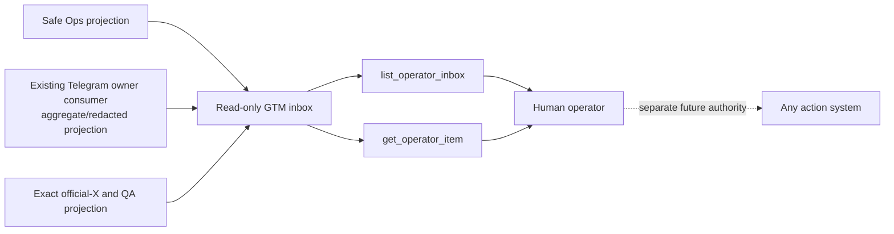

# ADR-021: Separate read-only GTM intelligence inbox

**Status:** Accepted for a local, provider-disconnected 14-day Squid shadow
pilot and pure sanitized-owner adapters; no authenticated owner reader,
deployment, or provider connection
**Date:** 2026-08-25
**Deciders:** CoinEasy operator

## Context

CoinEasy already has several deliberately separate operating surfaces:

- the Agent Work Order control plane describes company objectives, receipts,
  and human authority;
- Harmony rehearses typed, client-scoped planning signals without execution;
- the independent Grok QA MCP reviews exact Content Studio versions and has
  its own advisory-verdict path;
- the community bots own their Telegram update offsets and private user data;
- Railway owns runtime state, schedules, and logs.

The operator needs one compact Korean view of what deserves attention across
GTM operations, community triage, and X narrative/QA. Reusing Harmony as a
general inbox would weaken its typed-signal and attestation contract. Expanding
the existing Grok QA MCP would mix content-version QA with broader operating
data and could accidentally widen its credential or write surface. Letting a
new agent poll Telegram or Railway directly would create duplicate consumers,
private-data exposure, and mutation risk.

The first useful step is therefore a read-only shadow contract, not another
executor.

## Decision

Add a **separate GTM intelligence inbox contract** with exactly three domains:

| Domain | Purpose | Allowed data |
| --- | --- | --- |
| `ops` | Explain service health, blockers, freshness, and receipt gaps | Bounded status codes, timestamps, claimed release SHA from a safe projection, aggregate counts, and consistency checksums |
| `telegram_triage` | Show the broad topic, answer state, and safety class of items needing human attention | Closed taxonomy codes, keyed-HMAC question references, sanitized Korean question summaries, FAQ-bound reply drafts, and human-review requirements |
| `x_narrative_qa` | Surface public-X narrative and exact QA review state | Squid official-source, public competitor/KOL signals, current content item/version references where applicable, consistency checksums, bounded QA state, and human-review requirements |

The inbox is a projection only. It has no source-of-truth tables, decision
state, work leases, or execution adapters. It cannot authorize or imply a
provider call, Telegram send, X/Typefully/Naver action, publication, deploy,
Railway mutation, environment change, or database write.

Phase 0 validates contract shape, privacy, domain/client binding, freshness,
and internal consistency only. Because it has no live owner-system reader, it
cannot prove that a deployment SHA is current, a content item/version is still
current, a receipt exists, or an external fact is true. The operator must
verify those claims in the authoritative owner surface during every daily
shadow review.



This decision permits local validation, rendering, bounded in-memory list/get,
and pure transformation of already sanitized owner-projection records for the
first 14-day Squid pilot. The CLI, broker, renderer, source bundle, and printed
schemas reject every client other than `squid` and every domain outside the
closed set `ops`, `telegram_triage`, and `x_narrative_qa`. They keep Grok and
every other model/provider disconnected.

The pure adapters are not source readers. They contain no Railway, Telegram,
X, database, filesystem, environment, subprocess, clock, send, verdict,
publication, or mutation client. An authenticated owner reader, source
credential, owner-side Telegram FAQ projection, schedule, deploy, HTTP/MCP
endpoint, or Grok/provider connection still requires a separate reviewed
change and explicit approval.

## Existing systems remain unchanged

### Grok QA MCP

The current Grok QA MCP, its three tools, exact-version receipts, private relay,
and human double-fact-check boundary remain unchanged. The GTM intelligence
inbox does not import, rename, proxy, or add fields to that MCP. In particular,
it does not replace `coineasy_submit_qa_verdict` and cannot submit a verdict.

### Harmony

Harmony signals, attestations, rehearsals, handoffs, Preview dashboard, and
operator inbox remain unchanged. A GTM intelligence item is not a Harmony
signal, attestation, turn, plan, stage receipt, or handoff. Reading Harmony's
safe projection in a future phase would require a separate decision; this P0
does not write to or advance Harmony.

### Telegram ownership

The existing owner process remains the only `getUpdates` consumer for each bot
token. The GTM inbox may read only a safe aggregate/redacted projection created
downstream of that owner. It must never call `getUpdates`, advance or copy an
offset, clear a shared buffer, register a webhook, or start a second polling
process.

### Railway ownership

The inbox may consume a separately designed safe health projection. It must
not receive a Railway token, execute Railway commands, change variables,
redeploy, restart, inspect raw environment values, or return raw logs. Raw log
lines are excluded because they may contain user data, private URLs, request
bodies, or credentials. A sanitized error code and observation timestamp are
sufficient for the inbox.

## Sanitized owner-adapter layer

The local adapter layer accepts only three closed owner records and composes
them through `coineasy-squid-gtm-source-bundle@1`:

| Source | Required boundary | Projection result |
| --- | --- | --- |
| Railway ops | `railway`, `sanitized_runtime_owner`, `squid:ops:read_only`, no raw logs/environment/provider payload/mutation | exact deployment/expected SHA, runtime, schedule, bounded failures, and a canonical consistency receipt |
| Telegram triage | `coineasydaily.single-consumer`, `post-owner-redaction`, no new consumer/raw update/identifier/private link/HMAC key | opaque question HMAC, original question observation time, explicit safety class, and FAQ-bound draft or escalation |
| X narrative/QA | `public_x_qa_owner_projection`, public sanitized allowlisted record, no raw text/private data/mutation/publication | exact public status URL/account plus content/version/banner/QA bindings where applicable |

Every source state must explicitly be `available` with at least one accepted
record or `unavailable` with one closed reason code. Ops may contain multiple
unique service records, while duplicate service names fail closed. An empty
tuple cannot mean an observed zero. The bundle always contains all three source states; the
composer emits a complete Squid-only page and converts unavailable sources to
`observed_count=null`.

Telegram FAQ drafts retain a canonical `faq_receipt` binding over the opaque
question reference, exact FAQ source checksum, FAQ match class, and exact
draft hash. The question evidence uses `question_observed_at`, not the later
owner projection time, so a stale question cannot be made fresh by re-running
the projection. Safety classification is mandatory and large Telegram-shaped
numeric identifiers fail at ingress.

Completed content-QA records retain a `qa_receipt_subject_sha256` binding over
the public source URL, content item/version, content checksum, optional banner
checksum, verdict, and issue codes. The QA receipt timestamp cannot precede
its source/content/banner evidence. `qa_receipt_sha256` is itself the
deterministic digest of a versioned envelope containing that exact subject
checksum, so one receipt value cannot be replayed across two different
subjects. X/QA free text is checked for the same
PII, secret, URL, and prompt-injection patterns at owner-record ingress as at
the final inbox boundary.

These hashes prove internal consistency only. The Railway digest is unkeyed,
the Telegram HMAC key is intentionally unavailable here, and X allowlist and
currentness flags are owner assertions. Therefore the DTOs may be consumed
only behind a separately authenticated owner reader; they must not be exposed
as an unauthenticated API or populated directly from arbitrary model output.
The included source bundle is synthetic contract data, not evidence of a live
connection.

## Canonical shadow contract

The saved page input contract is `coineasy-gtm-inbox@1`. A valid Phase 0 seed
has `mode=shadow_read_only`, `read_only_projection=true`, all call/publication
flags false, and `next_cursor=null`. Every seed item has `client_id=squid`, and
the set of item domains is exactly `ops`, `telegram_triage`, and
`x_narrative_qa`; an empty, partial, cross-client, or pre-paginated seed fails
closed. The canonical valid fixture is
`examples/gtm-intelligence-squid-shadow.json`.

Every item uses `coineasy-gtm-operator-item@1` and is bound to one `ref`,
domain, event type, client, and UTC observation time. Common fields contain a
bounded Korean title and summary, typed evidence, explicit lineage, a
fail-closed policy, and a human-gated next action. The `details.schema_version`
discriminator must match exactly one of:

- `coineasy-ops-detail@1` for `ops`;
- `coineasy-telegram-triage-detail@1` for `telegram_triage`;
- `coineasy-narrative-qa-detail@1` for `x_narrative_qa`;
- `coineasy-unobserved-detail@1` only when the item status is `unobserved`,
  with `source_domain` exactly matching the item's domain.

Observed ops details bind `source_receipt_sha256` to an exact
`runtime_receipt` evidence checksum. A content-QA item binds its content and,
when present, banner checksums to exact evidence entries. A non-pending QA
verdict also requires `qa_receipt_sha256` and an exact `qa_receipt` evidence
binding; a pending verdict cannot claim that receipt. These bindings prove
internal consistency only, not external receipt existence or authenticity.

Unknown fields, unknown enum values, domain/detail mismatches, malformed
lineage, duplicate references, wrong-client items, out-of-scope domains, and
stale timestamps fail closed. Every item and every evidence observation must be
no older than 24 hours relative to `generated_at`; timestamps more than the
bounded five-minute clock skew into the future also fail. Evidence cannot be
later than its item beyond that same skew. A stale item or stale evidence record
invalidates the page rather than becoming a current recommendation.

### Observation contract

An observed zero and an unavailable measurement are different states. Missing,
blocked, stale, or inaccessible source data uses the bounded `unobserved`
state. `coineasy-unobserved-detail@1` fixes `observed_count` to `null`, carries
only a safe reason code and optional last-observed time, and cannot carry
evidence or source-object lineage. It must never be normalized, summed,
averaged, ranked, or rendered as zero.

For the Phase 0 ops detail, `failure_count=0` is accepted only with an observed
healthy runtime, degraded/failed requires at least one observed failure and a
safe failure code, and an unobserved runtime requires `failure_count=null`. A
numeric zero is valid only when the authoritative safe projection explicitly
observed zero for the stated window.

Scheduled ops observations also carry an exact bounded
`schedule_interval_seconds` and `schedule_grace_seconds`. `next_tick_at` must
equal `last_tick_at + schedule_interval_seconds`; `on_time`, `late`, and
`missed` are checked against the item observation and grace window. A
`not_scheduled` or `unobserved` schedule cannot carry tick or interval values.

The page's derived count of zero items is only a count of validated inbox
items. It is not evidence that a source metric was observed as zero.

### Checksums and external truth

Item, page, content, banner, evidence, and receipt hashes are deterministic
consistency checksums. If an input supplies `item_sha256` or `snapshot_sha256`,
Phase 0 recomputes the canonical checksum and rejects a mismatch. This can show
that two already supplied byte sequences match; it is not a digital signature,
attestation, proof of origin, or proof that the referenced external object
exists or is current. Phase 0 must never label a checksum match as owner
verification.

Deployment state, current content/version identity, receipt existence, and
official-source claims remain unverified until the operator compares them with
their authoritative owner surfaces during that day's shadow review.

## Privacy and prompt boundary

The contract forbids:

- Telegram user IDs, usernames, display names, chat IDs, message IDs, invite
  links, private message links, callback data, or bot tokens;
- raw Telegram update payloads, DMs, answers, or verbatim quoted excerpts;
- email addresses, phone numbers, wallet addresses, session IDs, IP addresses,
  cookies, credentials, request headers, environment values, or hashed user
  identifiers;
- raw Railway, Netlify, database, provider, or application logs;
- private Content Studio, Telegram, Figma, Notion, or preview links;
- untrusted instructions copied from source text or prompt-injection language.

Every free-text field applies the same bounded detector for known PII,
credential, URL, and prompt-injection patterns. This applies equally to titles,
summaries, questions, reply drafts, next-action wording, claims, and
comparisons. A recognized pattern rejects the entire payload; the validator
does not redact after exposure and continue. Pattern matching cannot prove that
arbitrary text is private-data-free or instruction-free, so reviewed upstream
sanitization and the manual privacy inspection remain mandatory.

`telegram_triage` uses closed taxonomy codes and bounded sanitized wording.
`digest_scheme` is fixed to `hmac-sha256-v1`, and `question_ref` carries the
keyed HMAC over owner-controlled canonical correlation material, not a raw SHA
of a question, Telegram ID, or user identifier. The HMAC key never appears in a
fixture, output, log, reference, or checksum. The question evidence reference
must bind to the same keyed-HMAC value. Phase 0 validates the scheme marker,
shape, and cross-binding but cannot recompute authenticity without the owner
key. The HMAC is pseudonymous correlation only; it is not a signature or proof
that the source message exists. A sanitized `question_summary_ko` may describe
the question without a username, handle, phone, wallet, URL, or private
identifier. Any FAQ-bound reply remains a draft. The human resolves the
underlying item in the owner system; the GTM inbox provides no deep link.

Public X URLs may appear only in `x_narrative_qa` and must have the
exact form `https://x.com/{handle}/status/{numeric_post_id}`, without query,
fragment, credentials, trailing path, or alternate host. The path handle,
and `source_account` must always bind to the same account. `official_source`
and `content_qa` additionally bind to the configured Squid official handle
`SquidRouter`; `competitor` and `kol` intentionally retain their public source
account while remaining `client_id=squid` review signals. This validates syntax
and identity configuration only; it does not prove that a post exists or that
its content is factual.
Style references, community interest, performance, and model output are not
factual evidence.

## Phase 0 local broker

`GtmReadOnlyBroker` is an in-memory adapter over one already validated
`GtmInboxPage`. It exposes only these Python methods:

```text
list_operator_inbox(domain=None, limit=20, cursor=None)
get_operator_item(ref)
```

The list method applies bounded filters and reference-based pagination; the get
method returns the exact item or no result. There is no client selector: the
Phase 0 seed validator fixes the complete projection to `squid`. `domain` is
one closed enum value or is omitted to list all three domains; arrays and
unknown domains fail closed.
The broker has no source credentials, network client, database client, provider
client, mutation method, verdict method, or publication method. It does not
ingest live data and is not an HTTP or MCP service.

The seed always has `next_cursor=null`. A later broker page may return an
in-memory opaque cursor digest bound to the seed snapshot checksum, the Squid
scope, the singular-domain filter or its omission, and the last returned `ref`.
A cursor cannot be reused across snapshots or filters, is not a durable
receipt, and is not accepted as a Phase 0 seed cursor.

## Future HTTP/MCP interface

A future, separately deployed MCP may advertise exactly two tools:

1. `list_operator_inbox`
2. `get_operator_item`

Both tools must declare `readOnlyHint: true`, `destructiveHint: false`,
`idempotentHint: true`, and `openWorldHint: false`. They use a dedicated
read-only credential. The list input accepts one singular `domain` or omits it
for all three domains. There is no client selector: the projection is fixed to
Squid. A `domains` array or client field fails closed. The list is
cursor-paginated and the detail lookup requires the exact opaque `ref`.

The MCP must not include tools for proposing, deciding, acknowledging,
claiming, retrying, scheduling, sending, approving, publishing, deploying,
changing configuration, fetching raw logs, or writing receipts. A future
decision tool belongs to a separate authority surface and credential.

## Fourteen-day Squid shadow pilot

The first pilot procedure is fixed to `client_id=squid` and all three domains.
Other clients and cross-client aggregation fail the pilot even if a later
version of the reusable base model recognizes those client codes.

The pilot is a saved-fixture, local shadow only:

- no Grok, xAI, OpenAI, Anthropic, or other provider call;
- no Telegram, Buzz, email, X, Typefully, Naver, or other message send;
- no publication, approval, schedule, deploy, feature-flag, or Railway action;
- no database insert, update, delete, RPC mutation, migration, or receipt write;
- no new Telegram poller or webhook;
- no storage of raw source payloads or raw logs.

Each pilot day compares the bounded shadow item with the authoritative owner
surface and records only a redacted manual evaluation outside the broker. Pass
criteria are:

- 14 daily observations with Squid-only scope;
- zero private identifiers, private links, raw messages, raw logs, or secrets;
- zero wrong-client items and zero duplicate current items;
- every seed containing Squid items for exactly all three domains and
  `next_cursor=null`;
- 100% of item and evidence timestamps inside the 24-hour freshness window;
- manual owner-surface verification of every claimed current/version/receipt
  fact, with unverifiable facts marked `unobserved`;
- every checksum described and evaluated as consistency only, never as a
  signature or authenticity proof;
- every unavailable metric rendered as `unobserved`, never zero;
- zero provider, send, publish, deploy, Railway mutation, and database-write
  actions;
- every action other than `no_action` remaining human-required, with
  `no_action` carrying no implied execution.

Any failure ends the pilot. It is not repaired by widening the schema,
requesting more credentials, or reading raw data.

## Options considered

### Option A: Extend the existing Grok QA MCP

| Dimension | Assessment |
| --- | --- |
| Initial implementation | Small |
| Authority clarity | Weak |
| Content-version isolation | At risk |
| Credential blast radius | Increased |

Rejected because content QA has a distinct exact-version verdict workflow and
must not become a general operations gateway.

### Option B: Reuse Harmony as the inbox

| Dimension | Assessment |
| --- | --- |
| Shared data model | Superficially convenient |
| Attestation semantics | Incorrect for routine status |
| Cross-client isolation | Easy to weaken |
| Execution separation | Ambiguous |

Rejected because Harmony is a typed planning rehearsal, not a generic status
store or Telegram triage system.

### Option C: Direct Grok access to Telegram, Railway, and Content Studio

| Dimension | Assessment |
| --- | --- |
| Freshness | High |
| Privacy | Unsafe |
| Duplicate-consumer risk | Critical |
| Least privilege | Fails |

Rejected because it exposes raw systems and gives one provider an excessive
operational blast radius.

### Option D: Separate bounded read-only projection (chosen)

| Dimension | Assessment |
| --- | --- |
| Authority clarity | Strong |
| Tenant and privacy isolation | Strong |
| Initial capability | Deliberately limited |
| Future portability | High through a versioned contract |

## Consequences

- The operator can evaluate a single bounded GTM inbox without granting action
  authority.
- Existing QA, Harmony, Telegram, and Railway ownership remain auditable and
  unchanged.
- The first pilot cannot demonstrate Grok synthesis quality because provider
  calls are intentionally absent.
- Safe upstream projections and scoped read credentials still require separate
  design, security tests, and approval.
- Any later Grok connection, durable pilot ledger, scheduler, additional
  client, or write/decision tool requires a new decision and explicit gate.

## Rollout gates

1. Review this contract and the companion
   `docs/GROK_GTM_INTELLIGENCE_RUNBOOK.md`.
2. Keep local fixtures free of raw identifiers, private links, raw payloads,
   raw logs, prompt injection, and service-role fallback.
3. Verify exact-schema, Squid/domain binding, all-free-text privacy, exact-X-URL
   binding, keyed-HMAC references, 24-hour item/evidence freshness,
   `unobserved`, broker pagination, and no-write tests before Day 1.
4. Prove the in-memory broker has no transitive provider, Telegram polling,
   messaging, publication, deployment, Railway mutation, or database-write
   imports; repeat this proof before any future HTTP/MCP wrapper.
5. Run the 14-day Squid saved-fixture shadow pilot.
6. Require a separate operator decision before installing the MCP or connecting
   Grok or any other provider.
